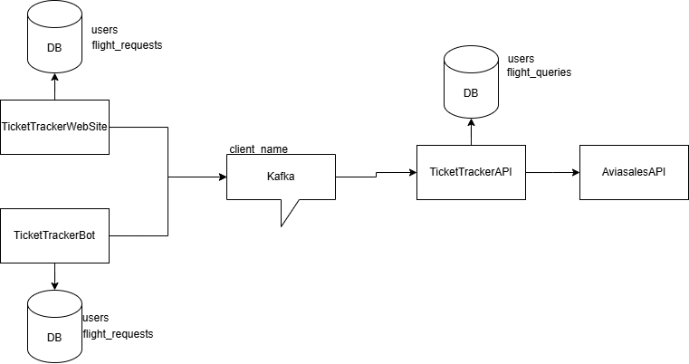

# Ticket Tracker API

Ticket Tracker API — это микросервис, предоставляющий API для обработки запросов на поиск авиабилетов и отслеживания цен.

## Содержание

1. [Описание проекта](#Описание-проекта)
2. [Технологии](#Технологии)
3. [Структура проекта](#Структура-проекта)
4. [Архитектура приложения](#Архитектура-приложения)
5. [Модель данных](#Модель-данных)
6. [Установка и запуск](#Установка-и-запуск)
    - [Требования](#Требования)
    - [Локальный запуск через Docker Compose](#Локальный-запуск-через-Docker-Compose)

## Описание проекта

- **Управление запросами**: создание, редактирование и удаление запросов на поиск билетов.
- **Отслеживание цен на билеты**: предоставление актуальной информации об интересующих вас билетах.
- **Интеграция с Kafka**: обмен сообщениями между микросервисами через брокер Kafka.
- **Использование базы данных**: хранение данных в PostgreSQL с поддержкой миграций через Liquibase.

## Технологии

- **Java 21**
- **Spring Boot**
- **PostgreSQL**
- **Docker / Docker Compose**
- **Apache Kafka**
- **Liquibase**
- **Gradle**
- **REST API**

## Структура проекта
```
TicketTrackerAPI/
├── scrapper/
│   ├── src/
│   │   ├── main/                      # Исходный код приложения
│   │   ├── test/                      # Тесты приложения
│   │
│   ├── .gitignore                     # Исключения для Git
│   ├── docker-compose/
│   │   ├── docker-compose.yml         # compose файл для развертывания приложения в Docker
│   │   ├── DockerFile                 # Dockerfile для создания образа
│   │   ├── kafka_server_jaas.conf     # Конфигурационный файл для Kafka
│   │   ├── zookeeper_jaas.conf        # Конфигурационный файл для Zookeeper
│   ├── build.gradle                   # Gradle файл для сборки
└── README.md                      # Документация
```

## Архитектура приложения

Функции API заключаются в обработке запросов от других микросервисов (например, бота или веб-сайта), передаче данных через Kafka и взаимодействии с базой данных.

## Модель данных


## Установка и запуск

### Требования

- Docker и Docker Compose
- Java 21+
- Gradle

### Локальный запуск через Docker Compose

1. Клонируйте репозиторий:
    ```bash
    git clone https://github.com/gw3nax/TicketTrackerAPI.git
    cd TicketTrackerAPI
    ```

2. Запустите все контейнеры:
    ```bash
    docker-compose up
    ```
