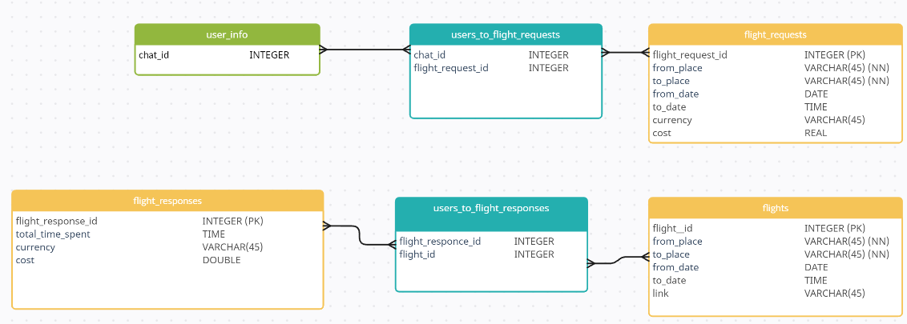

# TicketTrackerBot
## Описание приложения
Телеграм-бот, который отправляет уведомления пользователю в случае, если параметры запроса пользователя были удовлетворены одним из имеющихся в наличии авиабилетов

Бот выдает пользователю список из первых 3-5 возможных авиабилетов (совокупности авиабилетов) которые удовлетворяют нескольким параметрам пользователя, таким, как: количество пересадок, время, затраченное на перелет и цена авиабилета.

## Предполагаемая архитектура приложения

Функции фронтенда будет выполнять Телеграм-бот, который, с помощью скраппера, получает данные о нужных пользователю рейсах.
В свою очередь скраппер обращается к внешним апи для получения информации о рейсах, которые указаны в базе данных.
## Модель данных

## Функциональные требования

1. **Поиск авиабилетов, согласно требований**
2. **Предоставление данных по авиабилетам по расписанию**
3. **Предоставление авиабилетов по требованию**
4. **Выбор маршрута перелета путем указания только начальной и конечной точек маршрута.**
5. **Выбор периодичности уведомлений**

## Требования к авиабилетам

1. **Цена**
2. **Длительность перелёта**
3. **Длительность пересадок**
4. **Обязательный точка транзита**